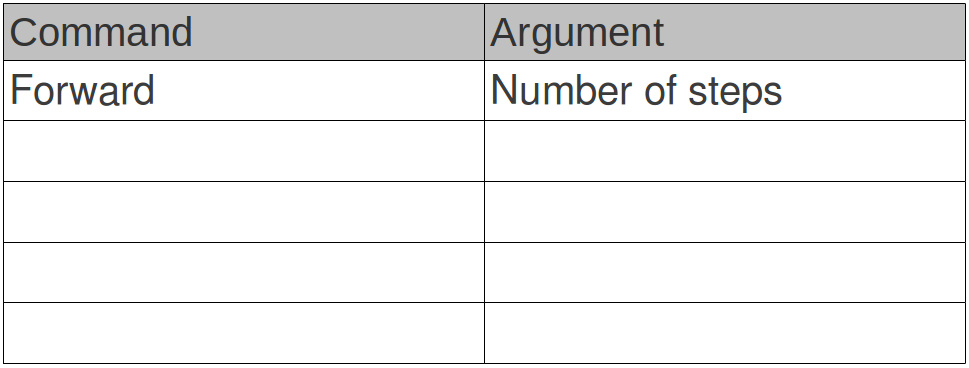
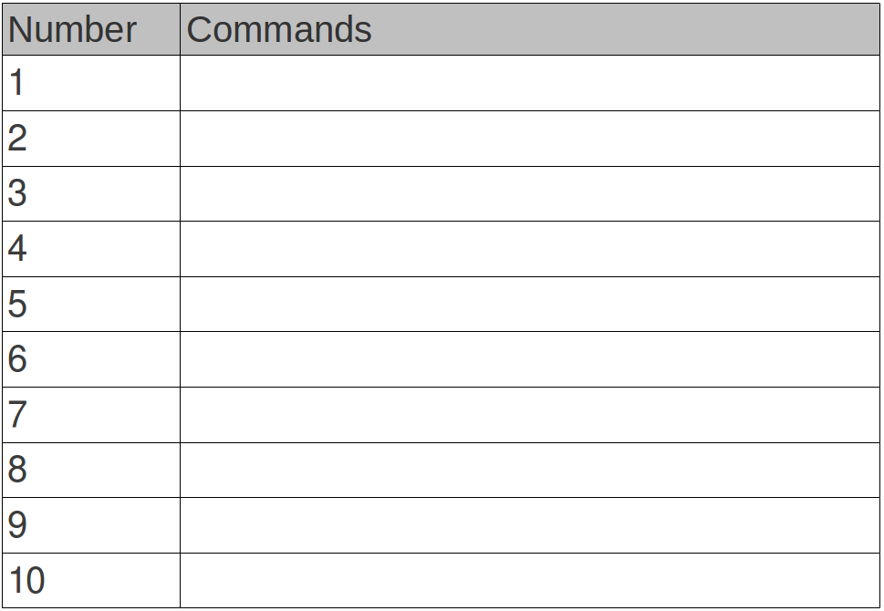

# Lesson 1

## Robot instructions

\ 

## Robot program

\ 

## Our first turtle program

The numbers on the left are line numbers and don't need to be typed in.
The codes on the right are Python commands and they have to be copied exactly as written. Make sure you copy all the symbols, and that everything is in the correct case.

~~~ { .python .numberLines }
from turtle import *
forward(100)
done()
~~~

When you're done, save your file as a combination of your names with a `.py` at the end. Then press `f5` to run it!

## Useful turtle commands

The parts of the line that come after a `#` are called comments, and are ignored by Python. You don't need to type them in.

~~~ python
left(90)        #turn left by 90 degrees
right(120)      #turn right by 120 degrees
pencolor("red") #change pen colour to red - note 'colour' is spelt 'color'
pensize(5)      #change the pen thickness to 5
penup()         #lift the pen up so we can move without drawing
pendown()       #put the pen down again
speed(0)        #draw as fast as possible
~~~
