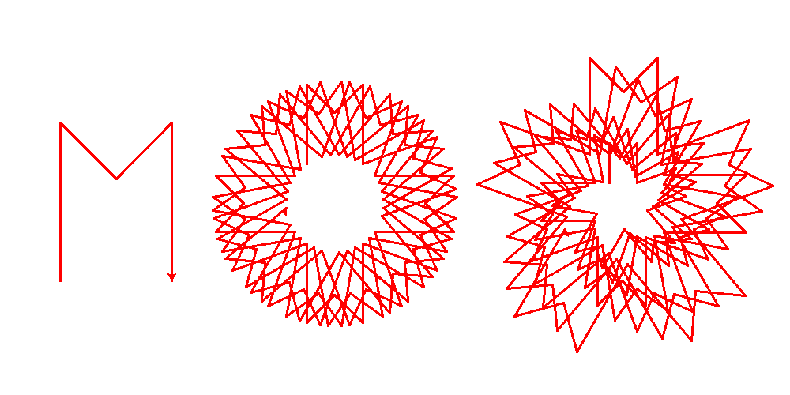

% The Turtle Prize - Lesson 2
% CPD for teachers
%

# Introduction

In lesson 1, students learnt that computer programs are written as a sequence of codes and that computers follow those codes exactly. They also started to use the Python turtle library to create simple graphics.

In the 2nd lesson, students will learn about loops and variables, and use them in their competition entries.

# Learning objectives

* Students will learn about loops, variables and operators.

# Resources

* 15 copies of [lesson 2 handout](lesson-2-handout.html)

# Lesson Summary

* Loops, variables and operators.
* Work on your competition entry.

## Homework discussion : 10 minutes

Ask students why Python is called Python. If none of them have seen any Monty Python, try showing them some videos you think they'd like. One of our favourites is the [bus animation](http://www.youtube.com/watch?v=xIIcNapznhE)

Ask students if any want to show some of the graphics they found and ask if they understood the code. A lot of the good stuff involves loops, which we'll be covering today. But before we can use loops, we need to understand variables.

## Hangman : 10 minutes

Start off by playing a version of hangman on the white board. This version teaches the importance of variables.

Don't record the wrong guesses, and have the students in a line, come up one by one to the board. They whisper their guess and if it's right, add the letter. If it's wrong tell them it's wrong but don't record it.

Play for a while and ask why it's harder than normal. The reason is that nobody knows all the wrong guesses because they haven't been recorded. 

As people, we take our short term memory for granted, but computers must be told explicitly to remember anything.

Variables have 3 important features:

* They can store some data,
* They can recall that data,
* The data they store can be changed.

The variables we'll be using will be storing numbers.

## Variables in Python : 10 minutes

Ask the students to start Idle and make a new file. Ask them to type the *variables* code in the handout. Ask them to save and run their file. Remember to add the `.py` to the end of their filename.

We use the single `=` to assign a number to a variable. Variables can be called pretty much anything, but there can be no spaces in the name. It's a good idea to choose a name that matches the variable's use. So if I need a variable to count loops, I could call it `loops`.

When we use the `+` to add to the variable, we are using an `operator`. Common mathematical operators include `+, -, /, *`.

## Loops in Python : 10 minutes

Ask the students to type in the code *looping* from their handouts. This can be added to the end of their current work.

Ask them to explain how the looping is working, and how it uses the variable to count the number of times the loop as run.

***loop_demo.py

1. create a new variable and store 0 inside,
2. the line that creates the loop. It will only loop while loops < 20,
3. prints 'hello',
4. adds 1 to the variable using the `+` operator.

### The done() and speed() commands

You may notice that some students are having problems shutting their windows. This will because their programs are no longer running the `done()` command because their loops never end. Also, some students will put the `done()` command inside their loop, so the program stops every loop.

Now we've introduce loops, some pictures may take some time to draw. Encourage student's to use the `speed(0)` command from the first handout to make the drawing happen as fast as possible.

## Work on their Turtle Prize entry : 15 minutes

Encourage the students to use variables and loops in their turtle code.
The following picture shows you how to spot the ideas students are using.

\ 

1. on the left is a simple sequence,
2. the centre shows the same sequence, but looped 30 times with a rotation between each loop,
3. the right shows the looped version, but the pattern gets a bit bigger every time using a variable that increases every loop.

## Extension Activity

Ask your students to investigate a loop within a loop:

***2loop_demo.py

These can add extra detail to drawings.

## Plenary : 5 minutes

Ask how a computer remembers data. Ask for an example of when this is necessary - for instance counting the number of loops have already been run.

Ask how we repeat computer code. Ask why looping is important in coding. What Python keyword do we use for creating a loop? The `while` keyword.

# Homework

Students are asked to investigate a new way of drawing by choosing something from [the documentation](http://docs.python.org/2/library/turtle.html#turtle-methods). They should only choose from the 'Move and draw' section.

# Outcome

All students:

* Understand that a variable can be used to store and retrieve data
* That loops are used to repeat sequences of code
* That computers need the codes to be written perfectly, or syntax errors will result

Most students

* Have used a loop and a variable in their competition entry

Some students

* Have used a variable to change the drawing as a loop progresses
